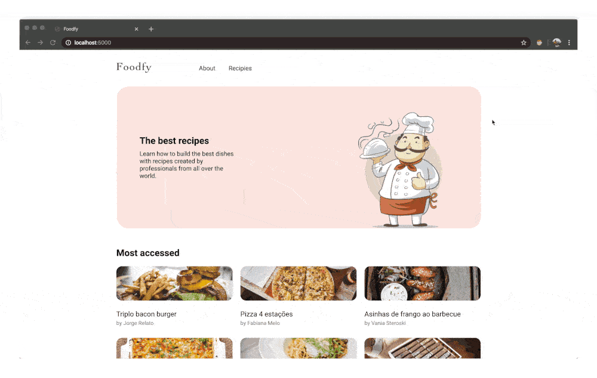

<h1 align="center">
    
</h1>

<h3 align="center">
  Foodfy
</h3>

<p align="center">

  <a href="/LICENSE" >
    
  </a>

  <a href="https://www.https://www.linkedin.com/in/italoteix/" >
    
  </a>
</p>

<p align="center">
  <a href="#rocket-about-this-repo">About this repo</a>&nbsp;&nbsp;&nbsp;|&nbsp;&nbsp;&nbsp;
  <a href="#bulb-building-foodfy">Building Foodfy</a>&nbsp;&nbsp;&nbsp;|&nbsp;&nbsp;&nbsp;
  <a href="#bulb-refactoring-foodfy">Refactoring Foodfy</a>&nbsp;&nbsp;&nbsp;|&nbsp;&nbsp;&nbsp;
  <a href="#bulb-foodfys-admin">Foodfy's Admin</a>&nbsp;&nbsp;&nbsp;|&nbsp;&nbsp;&nbsp;
  <a href="#bulb-persisting-data-on-foodfy">Persisting data on Foodfy</a>&nbsp;&nbsp;&nbsp;|&nbsp;&nbsp;&nbsp;
  <a href="#bulb-upload-images-to-foodfy">Upload images to Foodfy</a>&nbsp;&nbsp;&nbsp;|&nbsp;&nbsp;&nbsp;
  <a href="#bulb-show-and-sort-foodfys-recipes">Show and Sort Foodfy's Recipes</a>&nbsp;&nbsp;&nbsp;|&nbsp;&nbsp;&nbsp;
  <a href="#gear-installing-and-running">Installing and Running</a>&nbsp;&nbsp;&nbsp;|&nbsp;&nbsp;&nbsp;
  <a href="#memo-license">License</a>
</p>

## :rocket: About this repo

This web site was develop as a challenge for the Rocketseat Launchbase Bootcamp 4, and uses the basics building blocks of the web: HTML, CSS and JavaScript to create a recipes site. The back-end was made with Node.js and Nunjucks as a view engine.

## :bulb: Building Foodfy

This was the first part of the challenge, no back-end, only a static site to begin with.

The description of this part of challenge can be read [here](https://github.com/Rocketseat/bootcamp-launchbase-desafios-02/blob/master/desafios/02-foodfy.md).

To see my code at this point of the challenge, go [here](https://github.com/italoteix/foodfy/tree/challenge-2).

<p align="center">
  
</p>

## :bulb: Refactoring Foodfy

The begining of the back-end. Node.js server using [express](https://expressjs.com/) and [Nunjucks](https://mozilla.github.io/nunjucks/) to render the views.

The description of this part of challenge can be read [here](https://github.com/Rocketseat/bootcamp-launchbase-desafios-03/blob/master/desafios/03-refatorando-foodfy.md).

To see my code at this point of the challenge, go [here](https://github.com/italoteix/foodfy/tree/challenge-3).

<p align="center">
  
</p>

## :bulb: Foodfy's Admin

Keep inprooving on server. CRUD server inplemented and rederind internal pages of Foodfy.

The description of this part of challenge can be read [here](https://github.com/Rocketseat/bootcamp-launchbase-desafios-04/blob/master/desafios/04-admin-foodfy.md).

To see my code at this point of the challenge, go [here](https://github.com/italoteix/foodfy/tree/challenge-4).

<p align="center">
  
</p>

## :bulb: Persisting data on Foodfy

Changed architecture to full MVC. Added pagination on recipes page and now we can search by recipes's name on home page. On admin, chef's pages were added and everything now consumes data on the Postegres database.

The description of this part of challenge can be read [here](https://github.com/Rocketseat/bootcamp-launchbase-desafios-05/blob/master/desafios/05-persistindo-dados-foodfy.md).

To see my code at this point of the challenge, go [here](https://github.com/italoteix/foodfy/tree/challenge-5).

## :bulb: Upload images to Foodfy

The project now handles files input on front and back-end using multer.

The description of this part of challenge can be read [here](https://github.com/Rocketseat/bootcamp-launchbase-desafios-07/blob/master/desafios/07-foodfy-envio-imagens.md).

To see my code at this point of the challenge, go [here](https://github.com/italoteix/foodfy/tree/challenge-7).

## :bulb: Show and Sort Foodfy's Recipes

The project now handles files input on front and back-end using multer.

The description of this part of challenge can be read [here](https://github.com/Rocketseat/bootcamp-launchbase-desafios-07/blob/master/desafios/07-foodfy-envio-imagens.md).

To see my code at this point of the challenge, go [here](https://github.com/italoteix/foodfy/tree/challenge-7).

## :gear: Installing and Running

### Installing

Make sure that you are at the project root directory and run the following command on your terminal

```bash
$ npm install
```

### Local server

Run this command

```bash
$ npm start
```

After that, the following message should be logged at your terminal

```bash
Server running on port 5000
```

Now open on your browser [http://localhost:5000/](http://localhost:5000/).

Enjoy!

## :memo: License

This Project is under MIT License. Read the [LICENSE](./LICENSE) file for more details.