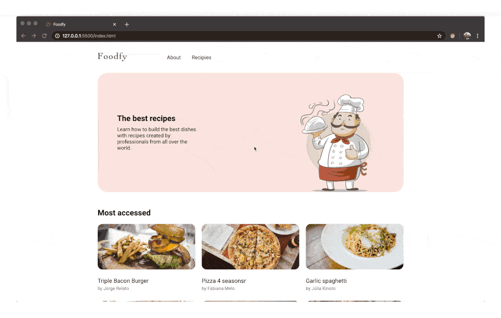

<h1 align="center">
    
</h1>

<h3 align="center">
  Study notes and challenges solutions for LaunchBase Bootcamp 04
</h3>

  

  

  <a href="#rocket-about-this-repo">About this repo</a>&nbsp;&nbsp;&nbsp;|&nbsp;&nbsp;&nbsp;
  <a href="#bulb-building-foodfy">Building Foodfy</a>&nbsp;&nbsp;&nbsp;|&nbsp;&nbsp;&nbsp;
  <a href="#memo-license">License</a>

## :rocket: About this repo

This web site was develop as a challenge for the Rocketseat Launchbase Bootcamp 4, and uses the basics building blocks of the web: HTML, CSS and JavaScript to create a recipes site.

For a live demo of the latest version of this challeng, click [here](https://italoteix.github.io/foodfy/).

## :bulb: Building Foodfy

The description of this challenge can be read [here](https://github.com/Rocketseat/bootcamp-launchbase-desafios-02/blob/master/desafios/02-foodfy.md).

  

## :memo: License

This Project is under MIT License. Read the [LICENSE](./LICENSE) file for more details.